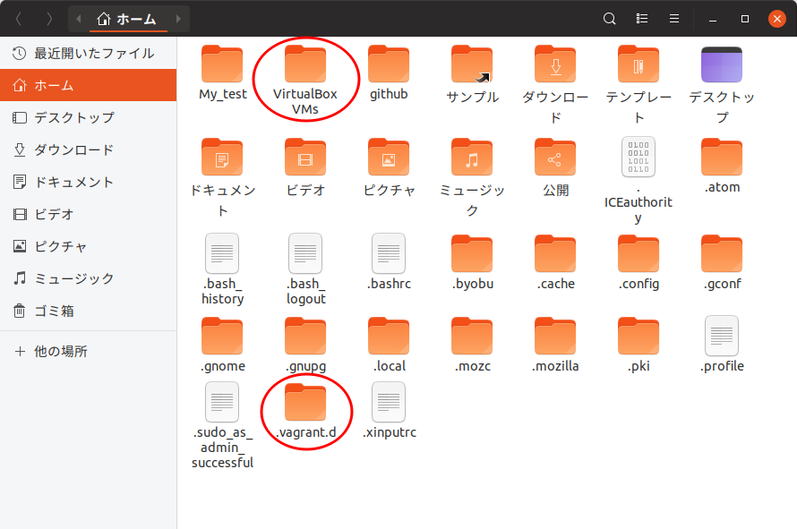

# Ansible_study
Ansible の使い方を勉強していく過程です


●Vagrant に関連するファイル：
ファイル|役割|置き場所  
--|--|--  
Vagrantfile|仮想マシンの設定|初期化したディレクトリ（./）  
boxファイル|仮想マシンの雛形|~/.vagrant.d/boxes/  
仮想マシンファイル|実際の仮想マシンのファイル|~/VirtualBox VMs  
SSH秘密鍵|仮想マシンのログインユーザー|./.vagrant/machines/  default/virtualbox/  private_key

●vagrantサブコマンド：
サブコマンド|役割  
--|--  
-v |バージョンの表示
-h|ヘルプの表示。サブコマンドにも指定可。
init|ディレクトリの初期化、Vagrantfileを生成
init ubuntu/hirsute64|BOXを指定して初期化
status|仮想マシンの状態の表示
up|仮想マシンを起動、無ければ作成して起動
halt|仮想マシンをシャットダウン
reload|仮想マシンを再起動
destroy|仮想マシンを削除
ssh|仮想マシンにSSHで接続
ssh-config|SSHの設定情報を表示
box list|BOXファイルの列記
box remove hoge|box(hoge)を削除

●Vagrantfileでconfig.vmで設定できる項目：
項目|具体例|意味  
--|--|--  
box|= "ubuntu/hirsute64"|boxの指定
box_check_update|= false|boxの更新チェックをしない
hostname|= "hoge"|仮想マシンのhostnameを指定
network|別掲|内部か外部の２種類あり
provision|"shell",inline: "echo Hello, World"|up時の処理

●network
|ポートフォワーディング|
|--|
| config.vm.network "forwarded_port", guest: 80, host: 8080|

|外部ネットワーク|
|--|
|config.vm.network "public_network", ip: "192.168.0.2"|

●ポイント：
項目|内容
--|--
共有フォルダ|ホストのVagrantディレクトリを、仮想マシンの/vagrantでマウント


## Ubuntu + Virtualbox + Vagrant でSSH接続環境の前準備編
Ansible のホストと対象マシンとして、２台の仮想マシンを用意します。１台の仮想マシンからもう１台の仮想マシンにSSHで接続できるようにしていきますが、ここではまず、仮想マシンを２台用意するところまでを記します。
1. Ubuntu マシンにapt-get で VagrantとVirtualboxを導入  
```sh
$ sudo apt-get install virtualbox vagrant
```
2. Vagrant 用のディレクトリを作って初期化（Vagrant init）  
```sh
$ mkdir MyLesson
$ cd ./MyLesson
$ ls
$ vagrant status
$ vagrant box list
$ vagsrant up
$ vagrant init
$ ls
```
3. 何も設定せず試す（Vagrant status/box list/up）  
```sh
$ vagrant up
```
4. Vagrantfile に box の設定のみして試す  
```sh
$ vi Vagrantfile
```  
`config.vm.box = "base"`  
となっている行を見つけて、以下のように修正。  
`config.vm.box = "ubuntu/cosmic64"`  
と直す。  
これは、ユーザー"ubuntu"さんが作った"cosmic64"という仮想マシンの雛形（box）を、vagrant の公式サイトからダウンロードしてきて使います、という意味になる。  
box は自分で作ることもでき、  
`$ vagrant package --base "VM名" --output "box名"`  
とすることでboxファイルが生成される。
```sh
$ vagrant up
```  
２０〜３０分かかると思うので、しばらく放置。  
またこのときに、  
`~/.vagrant.d`  
や  
`~/VirtualBox VMs`  
というディレクトリも作成される。  
box ファイルは　`~/.vagrant.d`　配下に保存され、仮想マシンの雛形として利用される。実際の仮想マシンは、これを　`~/VirtualBox VMs`　配下にコピーして格納される。  
待っている間に、ホームディレクトリを「隠しファイルを表示する」で表示しておくとこれらのディレクトリが作成されるのが見られたり、またVirtualbox マネージャー 画面を表示しておくと、vagrant コマンドによって仮想マシンが登録されて起動・シャットダウンされるのが確認できる。  

ファイル|置き場所|役割  
--|--|--  
Vagrantfile|初期化したフォルダ直下|仮想マシンの設定  
boxファイル|~/.vagrant.d|仮想マシンの雛形  
仮想マシンファイル|~/VirtualBox VMs|実際の仮想マシンのファイル  



5. ホストマシンから VM に ssh で接続してみる。キーはどこにある？ほかにどんな設定が可能なのか（vagrant ssh）  
```sh
$ vagrant status
$ vagrant box list  
$ vagrant halt
$ vagrant status
$ vagrant up
$ vagrant status
```  
この状態で、vm にssh 接続してみる。  
```sh  
$ vagrant ssh-config  
$ vagrant ssh  
vagrant@default :$ hostname  
vagrant@default :$ ifconfig
```  
6. Vagrantfile で hostname と ip を設定してみる。  
`config.vm.hostname = "web"`  
`config.vm.network :private_network, ip:"192.168.33.11"`  
これで<kbd>vagrant up</kbd>して、改めて<kbd>vagrant ssh</kbd>してみると  
```sh
$ hostname  
$ ifconfig  
```  
7. いちど仮想マシンを削除しする。て作り直してみる。  
```sh  
$ vagrant destroy  
$ vagrant up  
```  
8. define で複数の項目を設定してみる  
`config.vm.define :web do |web|`  
`web.vm.hostname = "web"`  
`web.vm.network :private_network, ip:"192.168.33.11"`  
`end`  
先にVagrantfile を書き換えてしまうと、古い仮想マシンが残ってしまう。  
一時的にVagrantfile を元に戻して、<kbd>vagrant destroy</kbd>すれば消せる。  
改めて<kbd>vagrant up</kbd>してから<kbd>hostname</kbd>と<kbd>ifconfig</kbd>してみる。  
9. ひとつのVagrantfile で２つのVMを設定してみる。  
`config.vm.define :web do |web|`  
`web.vm.hostname = "web"`  
`web.vm.network :private_network, ip:"192.168.33.11"`  
`end`  
`config.vm.define :db do |db|`  
`db.vm.hostname = "db"`  
`db.vm.network :private_network, ip:"192.168.33.12"`  
`end`  
こうすると、<kbd>vagrant up</kbd>すれば仮想マシン「web」と「db」が立ち上がる。  
複数の仮想マシンが定義されたVagrant 環境では、コマンドの引数に仮想マシン名を指定して、対象を区別する。  
```sh  
$ vagrant ssh  
$ vagrant ssh web  
$ vagrant halt db  
$ vagrant status  
$ vagrant up db  
$ vagrant status  
$ vagrant destory web  
$ vagrant status  
$ vagrant halt db  
$ vagrant status  
$ vagrant up web  
$ vagrant status  
```  
など、いろいろ試してみる。  
10. VM 間でSSH接続する。（ssh-keygen）  
11. SSHで必要なファイルとその格納場所のまとめ（/etc/ssh/ ~/.ssh/）  
12.  別ディレクトリにもvagrant 環境をつくり、３つめのVMを立てて ssh 接続してみる。  
13. Vagrantfile のまとめ  

公式HP  
https://docs.vagrantup.com  
boxを探す  
https://vagrantcloud.com/search  
コマンドラインのマニュアル  
https://www.vagrantup.com/docs/cli/  
Vagrantfileのマニュアル  
https://www.vagrantup.com/docs/vagrantfile/  

 設定可能な項目 | 内容
----|----
 config.vm | 仮想マシンの設定
 config.ssh | TD4
 config.winrm | TD4
 config.winssh | TD4
 config.vagrant | TD4

記法  
https://www.vagrantup.com/docs/vagrantfile/tips.html  

　~/.ssh/authorized_keys  
 ~/.ssh/known_hosts  
 /etc/ssh/ssh_host_hoge_key  
 /etc/ssh/ssh_host_hoge_key.pub  
