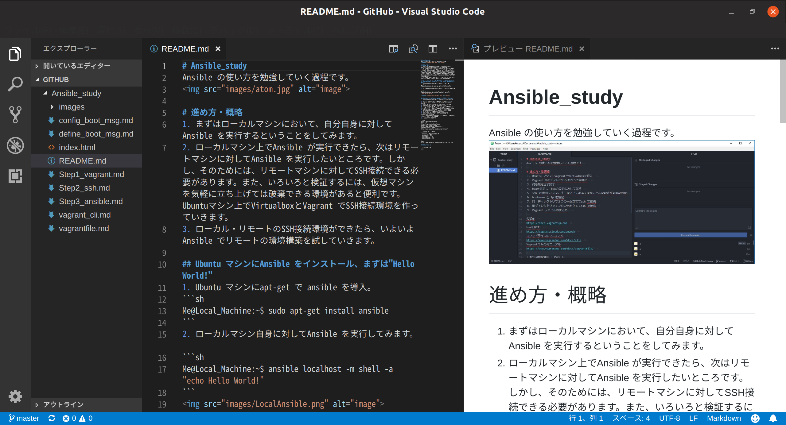

# Ansible_study
Ansible の使い方を勉強していく過程です

## Ubuntu + Virtualbox + Vagrant でlocalhost に SSH接続編
今回は、１台の仮想マシンを用意して、<kbd>vagrant ssh</kbd>ではなく<kbd>ssh</kbd>コマンドでssh 接続してみます。

1. localhost で<kbd>ssh-keygen -t rsa</kbd>  
2. "/home/hoge/.ssh/id_rsa.pub"をコピー  
3. 仮想マシンの "~/.ssh/authorized_keys"にペースト
4. 