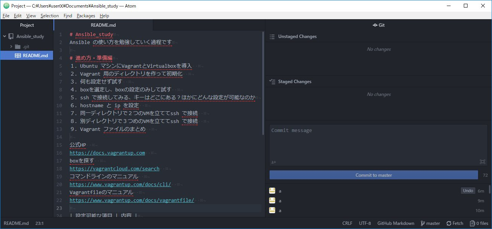

# Ansible_study
Ansible の使い方を勉強していく過程です


## Ubuntu + Virtualbox + Vagrant でSSH接続環境の前準備編
前回、２台の仮想マシンを用意しましたので、ここでは１台の仮想マシンからもう１台の仮想マシンにSSHで接続できるようにしていきます。  
SSH接続では、パスワード認証での接続もできますが、ここでは公開鍵認証の前提で進めます。  
SSH接続では、「ホスト認証」と「ユーザー認証」の２つの認証が行われます。それぞれ、「いまから接続するSSHサーバは真正かの確認」と、「いまから接続してくるSSHクライアントは正規のユーザーかの確認」となります。  

マシン|鍵の種類|鍵の置き場所  
 -|-|-  
SSHサーバ|サーバの秘密鍵|`/etc/ssh/ssh_host_hoge_key`  
 ー |サーバの公開鍵|`/etc/ssh/ssh_host_hoge_key.pub`  
 ー |ユーザーの公開鍵|`~/.ssh/authorized_keys`  
SSHクライアント|サーバーの公開鍵|`~/.ssh/known_hosts`  
 ー |ユーザーの公開鍵|`~/.ssh/authorized_keys`  

1. まず、仮想マシンを２台とも立ち上げ、<kbd>ping</kbd> コマンドで疎通を確認します。  
```sh
me@my_pc:~/My_test$ vagrant ssh web  
vagrant@web:$ ping 192.168.33.12  
vagrant@web:$ ls .ssh  
vagrant@web:$ ssh 192.168.33.12  
```
そうすると、次のようなエラーメッセージが出ると思います。  
「サーバ認証したことないホストにつなごうとしてるよ。暗号化方式ECDSAの鍵ペアのフットプリントがこういうサーバーだけど、ほんとにつなぐの？」  
と言われています。ここは<kbd>yes</kbd>とすればよいと思います。  
```sh
vagrant@web:~$ ssh 192.168.33.12  
"The authenticity of host '192.168.33.12 (192.168.33.12)' can't be established.   
ECDSA key fingerprint is SHA256:40FdK9XWaizUpGmj0SR3NqResNdYEuY2Da+i43+AXVM.  
Are you sure you want to continue connecting (yes/no)?" y  
"Please type 'yes' or 'no':" yes
"Warning: Permanently added '192.168.33.12' (ECDSA) to the list of known hosts. "Enter file in which the key is (/root/.ssh/id_rsa): /etc/ssh/ssh_host_ecdsa_key.pub
256 SHA256:q8tIzSTR7qEqGApnYDimv4fuBWPRJCyjP08VGu6SwCY root@ubuntu-cosmic (ECDSA)
"vagrant@192.168.33.12: Permission denied (publickey)."  
vagrant@web:~$ ls -al .ssh
```  

2. 念の為、SSHサーバで、鍵のフットプリントを表示させて比較してみましょう。  
```sh
vagrant@db:~$ ssh-keygen -l  
"Enter file in which the key is (/root/.ssh/id_rsa):" /etc/ssh/ssh_host_ecdsa_key.pub  
256 SHA256:q8tIzSTR7qEqGApnYDimv4fuBWPRJCyjP08VGu6SwCY root@ubuntu-cosmic (ECDSA)
```    
3. ユーザー認証のための鍵を作ります。  
SSHクライアント側でキーを作り、SSHサーバ上のユーザーのホームディレクトリにあるAuthorized_keys ファイルにマージします。
```sh  
$ vagrant ssh db  
vagrant@db:~$ ssh-keygen -t rsa
"Generating public/private rsa key pair.  
Enter file in which to save the key (/home/vagrant/.ssh/id_rsa):  
Enter passphrase (empty for no passphrase):  
Enter same passphrase again:  
Your identification has been saved in /home/vagrant/.ssh/id_rsa.  
Your public key has been saved in /home/vagrant/.ssh/id_rsa.pub.  
The key fingerprint is:  
SHA256:O9CwgHWuFTgaA/P6QFo5wGDO/Ip62T4Lqn5HYGvBeBs vagrant@db  
The key's randomart image is:  
+---[RSA 2048]----+  
|Bo  ..o          |  
|==o+oo .         |  
| =O+..+          |  
|o+oE + +         |  
|+ o.B o S        |  
|.o.+ . . .       |  
|..+o.   o        |  
|..ooo.   .       |  
|*o..+o           |  
+----[SHA256]-----+"  
vagrant@db:~$ ls -al .ssh/  
"total 20
drwx------ 2 vagrant vagrant 4096 Nov 17 08:10 .  
drwxr-xr-x 5 vagrant vagrant 4096 Nov 17 01:15 ..  
-rw------- 1 vagrant vagrant  389 Nov 16 10:53 authorized_keys  
-rw------- 1 vagrant vagrant 1766 Nov 17 08:10 id_rsa  
-rw-r--r-- 1 vagrant vagrant  392 Nov 17 08:10 id_rsa.pub"  
vagrant@db:~$  
```
4. SSHサーバ側に公開鍵をコピー
```sh
vagrant@web:~$ vi ~/.ssh/authorized_keys  
vagrant@web:~$  
```
別ディレクトリにもvagrant 環境をつくり、３つめのVMを立てて ssh 接続してみる。  
5. いよいよSSH接続  
```sh
vagrant@db:~$ ssh vagrant@192.168.33.12   
vagrant@web:~$  
```
6. SSHで必要なファイルとその格納場所のまとめ（/etc/ssh/ ~/.ssh/）  
`~/.ssh/authorized_keys`  
`~/.ssh/known_hosts`  
`/etc/ssh/ssh_host_hoge_key`  
`/etc/ssh/ssh_host_hoge_key.pub`  
別ディレクトリにもvagrant 環境をつくり、３つめのVMを立てて ssh 接続してみる。  
6. まとめ

公式HP  
https://docs.vagrantup.com  
boxを探す  
https://vagrantcloud.com/search  
コマンドラインのマニュアル  
https://www.vagrantup.com/docs/cli/  
Vagrantfileのマニュアル  
https://www.vagrantup.com/docs/vagrantfile/  

 設定可能な項目 | 内容
----|----
 config.vm | 仮想マシンの設定
 config.ssh | TD4
 config.winrm | TD4
 config.winssh | TD4
 config.vagrant | TD4

記法  
https://www.vagrantup.com/docs/vagrantfile/tips.html  
